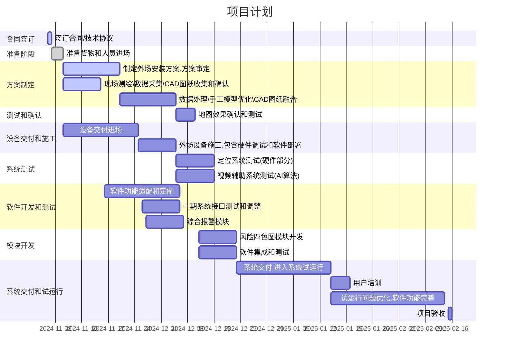

```mermaid
gantt
    title 项目计划
    dateFormat  YYYY-MM-DD
    section 合同签订
    签订合同/技术协议 :active, 2024-11-01, 1d
    section 准备阶段
    准备货物和人员进场 :done, 2024-11-02, 3d
    section 方案制定
    制定外场安装方案,方案审定 :active, 2024-11-05, 15d
    现场测绘\数据采集\CAD图纸收集和确认 :active, 2024-11-05, 10d
    数据处理\手工模型优化\CAD图纸融合 :2024-11-20, 15d
    section 测试和确认
    地图效果确认和测试 :2024-12-05, 5d
    section 设备交付和施工
    设备交付进场 :2024-11-05, 20d
    外场设备施工,包含硬件调试和软件部署 :2024-11-25, 10d
    section 系统测试
    定位系统测试(硬件部分) :2024-12-05, 10d
    视频辅助系统测试(AI算法) :2024-12-05, 10d
    section 软件开发和测试
    软件功能适配和定制 :2024-11-16, 20d
    一期系统接口测试和调整 :2024-11-26, 10d
    综合报警模块 :2024-11-27, 10d
    section 模块开发
    风险四色图模块开发 :2024-12-11, 10d
    软件集成和测试 :2024-12-11, 10d
    section 系统交付和试运行
    系统交付,进入系统试运行 :2024-12-21, 25d
    用户培训 :2025-01-15, 5d
    试运行问题优化,软件功能完善 :2025-01-15, 30d
    项目验收 :2025-02-15, 1d
```

