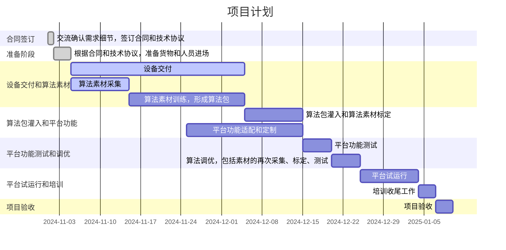

```mermaid
gantt
    title 项目计划
    dateFormat  YYYY-MM-DD
    section 合同签订
    交流确认需求细节，签订合同和技术协议 :done, 2024-11-01, 1d
    section 准备阶段
    根据合同和技术协议，准备货物和人员进场 :done, 2024-11-02, 3d
    section 设备交付和算法素材
    设备交付 :active, 2024-11-05, 30d
    算法素材采集 :active, 2024-11-05, 10d
    算法素材训练，形成算法包 :2024-11-15, 20d
    section 算法包灌入和平台功能
    算法包灌入和算法素材标定 :2024-12-05, 10d
    平台功能适配和定制 :2024-11-25, 20d
    section 平台功能测试和调优
    平台功能测试 :2024-12-15, 5d
    算法调优，包括素材的再次采集、标定、测试 :2024-12-20, 5d
    section 平台试运行和培训
    平台试运行 :2024-12-25, 10d
    培训收尾工作 :2025-01-04, 3d
    section 项目验收
    项目验收 :2025-01-07, 3d
```
